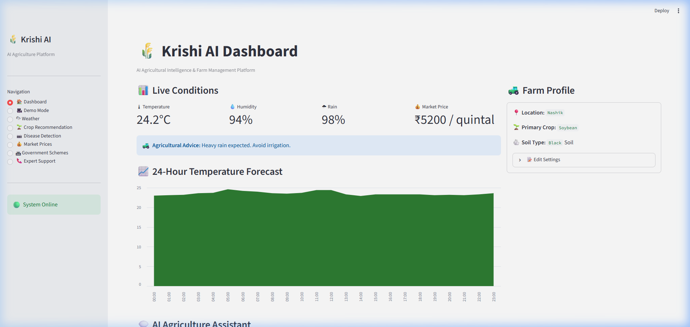
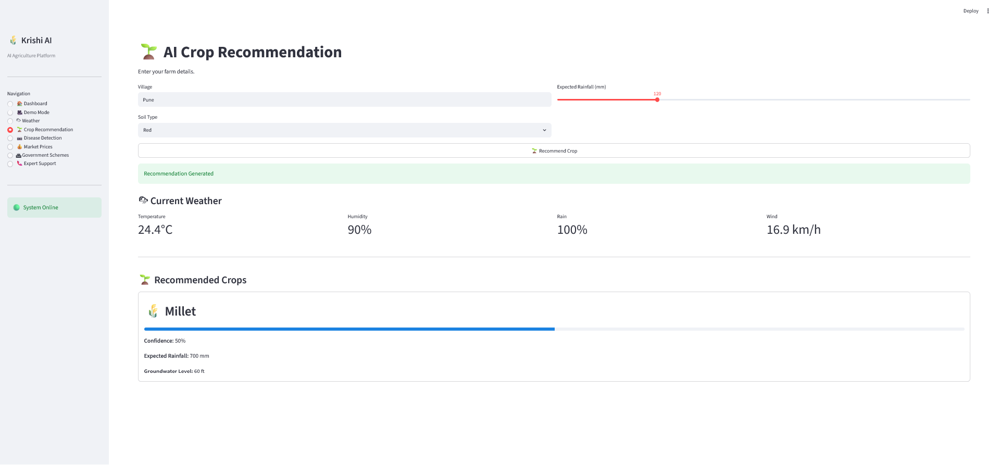
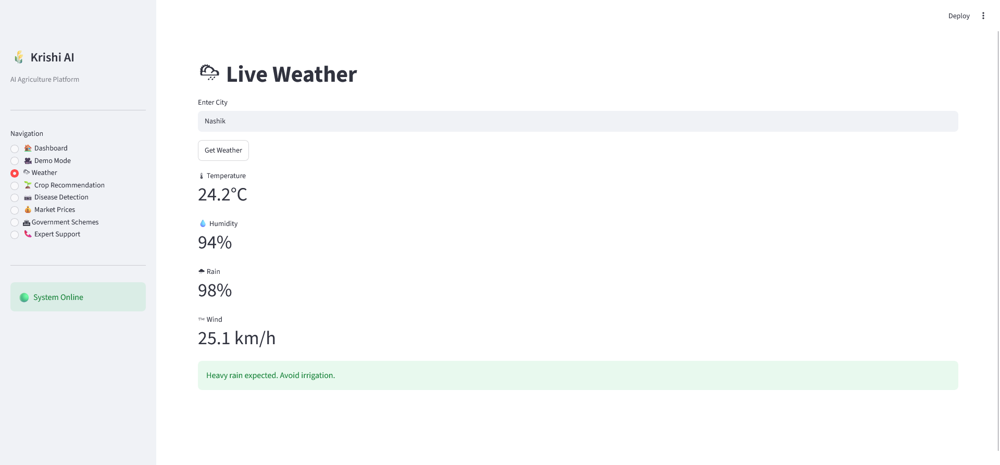
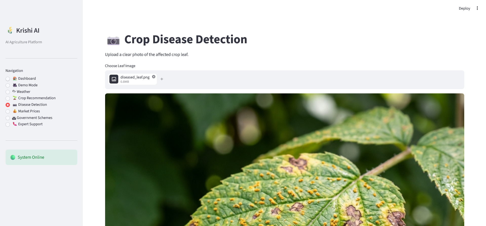
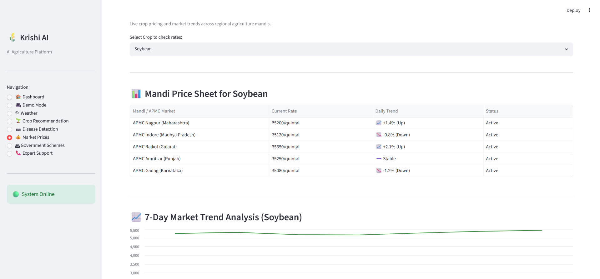
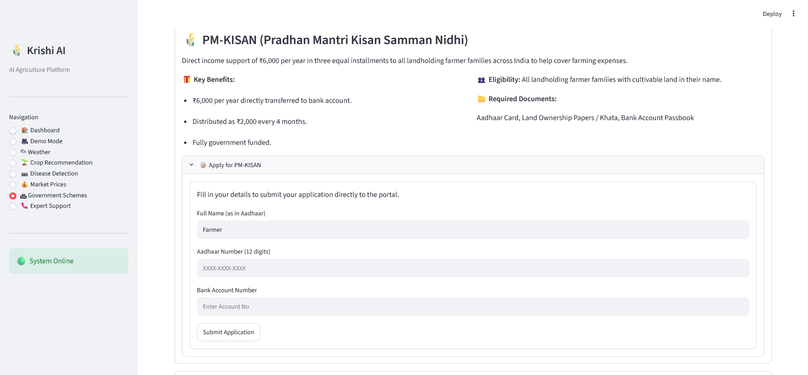
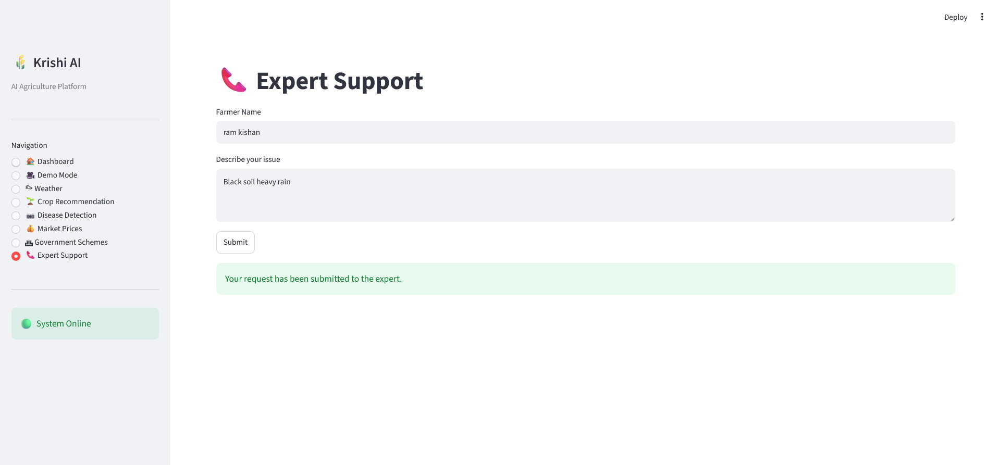

# 🌾 Krishi AI
### AI-Powered Agricultural Intelligence Platform for Small & Marginal Farmers

# 📖 Overview

Krishi AI is an intelligent agriculture platform that helps farmers make informed decisions using **Generative AI**, **Google ADK**, and multiple AI-powered tools.

The platform combines crop recommendations, weather intelligence, disease detection, market prices, government schemes, and expert assistance into one easy-to-use application.

Designed for small and marginal farmers, Krishi AI delivers personalized agricultural advice through an intuitive Streamlit interface powered by Google Gemini.

---

# 🎯 Problem Statement

Farmers often struggle with:

- Unpredictable weather
- Incorrect crop selection
- Plant diseases
- Lack of real-time market prices
- Limited access to government schemes
- Difficulty reaching agricultural experts
- Fragmented agricultural information

These challenges result in:

- Reduced crop yield
- Water wastage
- Financial losses
- Delayed disease detection
- Poor decision making

---

# 💡 Solution

Krishi AI provides a single AI-powered platform capable of:

✅ Smart Crop Recommendation

✅ Real-Time Weather Intelligence

✅ AI Leaf Disease Detection

✅ Market Price Prediction

✅ Government Scheme Discovery

✅ Farmer Profile Memory

✅ Expert Support Ticket Generation

✅ Personalized Agricultural Guidance

---

# ✨ Features

## 🌱 Crop Recommendation

- AI-powered crop suggestions
- Soil-aware recommendations
- Rainfall-based analysis

---

## 🌦 Weather Intelligence

- Current weather
- Hourly forecast
- Irrigation recommendations

---

## 📷 Plant Disease Detection

Upload a crop image to:

- Detect diseases
- Identify healthy plants
- Recommend treatments

---

## 💰 Market Prices

View current agricultural market prices.

---

## 🏛 Government Schemes

Discover relevant government schemes based on farmer requirements.

---

## 👨‍🌾 Farmer Memory

Krishi AI remembers:

- Village
- Soil Type
- Preferred Crops

This enables personalized recommendations in future interactions.

---

## 📞 Expert Support

When AI confidence is low:

- Automatically creates a support ticket
- Escalates the issue to agricultural experts

---

# 🏗 System Architecture

```text
                        Farmer
                           │
                           │
                    Streamlit Frontend
                           │
                    Intelligent Router
                           │
                  Google Gemini (ADK)
                           │
       ┌───────────────────┼────────────────────┐
       │                   │                    │
 Crop Tool          Weather Tool        Vision Tool
       │                   │                    │
       ├───────────┬──────────────┬─────────────┤
       │           │              │             │
 Market Tool   Scheme Tool   Profile Tool   Ticket Tool
                           │
                      Local Database
```

---

# 🤖 AI Agent Architecture

```text
                    Root Agent
                (Google Gemini)

                       │

        ┌──────────────┼──────────────┐

        │              │              │

 Crop Recommendation   Weather    Disease Detection

        │              │              │

recommend_crop()   get_weather()   analyze_leaf()

        │              │              │

 Profile Tool      Weather API      Vision Model

        │

 Market Tool

 Scheme Tool

 Ticket Tool
```

The Root Agent intelligently selects the minimum number of tools required to answer a farmer's query.

---

# 🧠 Intelligent Workflow

```text
Farmer asks question

        │

Google Gemini Agent

        │

Intent Detection

        │

Relevant Tool Selection

        │

Execute Tool

        │

Collect Results

        │

Generate Personalized Response

        │

Return to Farmer
```

---

# 🛠 Tech Stack

| Layer | Technology |
|--------|------------|
| Frontend | Streamlit |
| Backend | Python |
| AI Model | Google Gemini 2.5 Flash |
| Agent Framework | Google ADK |
| Weather | Weather Tool/API |
| Vision | Image Analysis Tool |
| Database | Local Database |
| Language | Python 3.11 |
| Deployment | Streamlit / FastAPI Compatible |

---

# 📂 Project Structure

```
krishiAI/

│
├── frontend/
│      app.py
│
├── krishi_ai/
│      agent.py
│      router.py
│      crop_agent.py
│      disease_agent.py
│      memory_agent.py
│
├── tools/
│      crop_tool.py
│      weather_tool.py
│      vision_tool.py
│      market_tool.py
│      scheme_tool.py
│      ticket_tool.py
│      profile_tool.py
│      memory_tool.py
│
├── database/
│
├── data/
│
├── requirements.txt
│
└── LICENSE
```

---

# ⚙ Installation

Clone the repository

```bash
git clone https://github.com/roma2020-app/krishiAI.git

cd krishiAI
```

Create virtual environment

```bash
python -m venv venv
```

Activate environment

### Windows

```bash
venv\Scripts\activate
```

### Linux / macOS

```bash
source venv/bin/activate
```

Install dependencies

```bash
pip install -r requirements.txt
```

---

# 🔑 Environment Variables

Create a `.env` file.

```
GOOGLE_API_KEY=YOUR_GEMINI_API_KEY
WEATHER_API_KEY=YOUR_WEATHER_API_KEY
```

---

# ▶ Running the Application

Launch Streamlit

```bash
streamlit run frontend/app.py
```

---

# 🚀 Deployment

The application can be deployed using:

- Hugging Face Spaces
- Render
- Railway
- Google Cloud Run
- Docker

---

# 🔄 Application Flow

```text
User

↓

Streamlit UI

↓

Google Gemini Agent

↓

AI Router

↓

Selected Tool

↓

Response Generated

↓

Farmer
```

---

# 📸 Screenshots

<h2 align="center">📸 Application Screenshots</h2>

<p align="center">


</p>

<p align="center">


</p>

<p align="center">


</p>

<p align="center">

</p>


```

---

# 🌍 Future Enhancements

- 🎤 Voice Assistant
- 🌐 Indic Language Support
- 📱 SMS Notifications
- 📡 Satellite Data Integration
- 🛰 Remote Sensing
- 🤖 Multi-Agent Collaboration
- 📈 Crop Yield Prediction
- 💧 Smart Irrigation Alerts
- ☁ Cloud Database
- 📍 GPS-based Recommendations

---

# 👥 Contributors

**Roma Gupta**

AI Developer | Google ADK | Gemini | Python | Streamlit

---

# 📜 License

This project is licensed under the MIT License.

See the LICENSE file for details.

---

# 🙏 Acknowledgements

- Google Gemini
- Google Agent Development Kit (ADK)
- Streamlit
- Python Community


---

# ⭐ Support

If you found this project useful:

⭐ Star this repository

🍴 Fork the project

🤝 Contribute improvements

---

> **Empowering Farmers with AI for Smarter, Sustainable Agriculture. 🌾**
